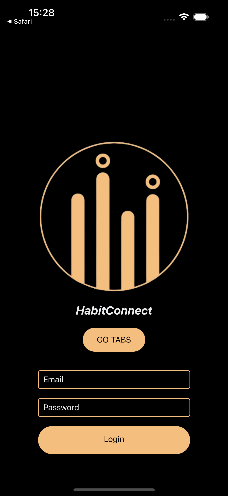
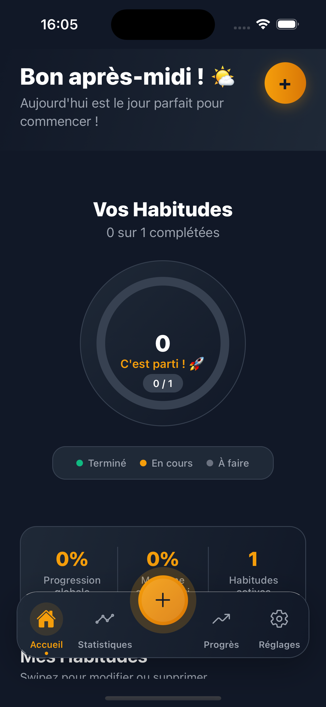
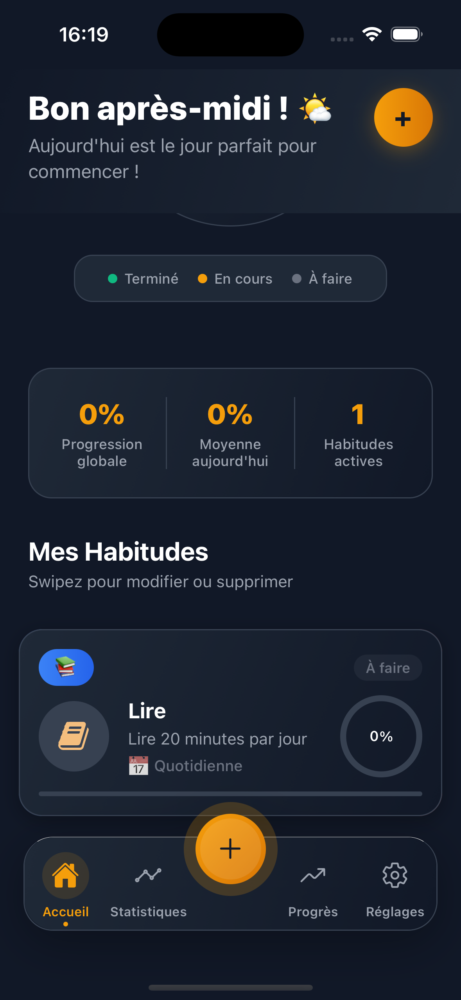
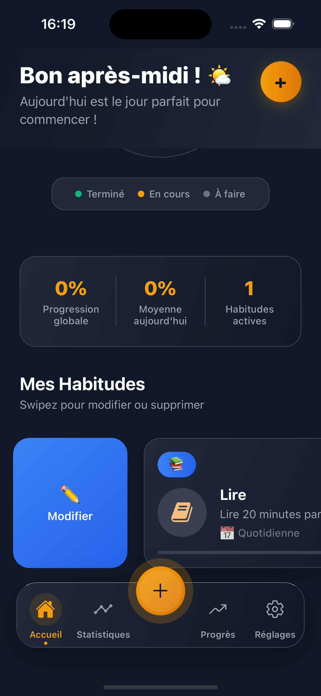
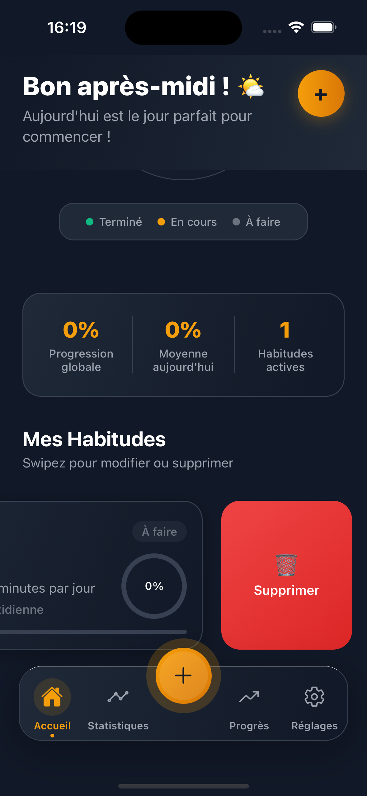
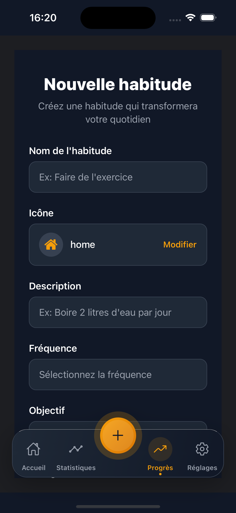
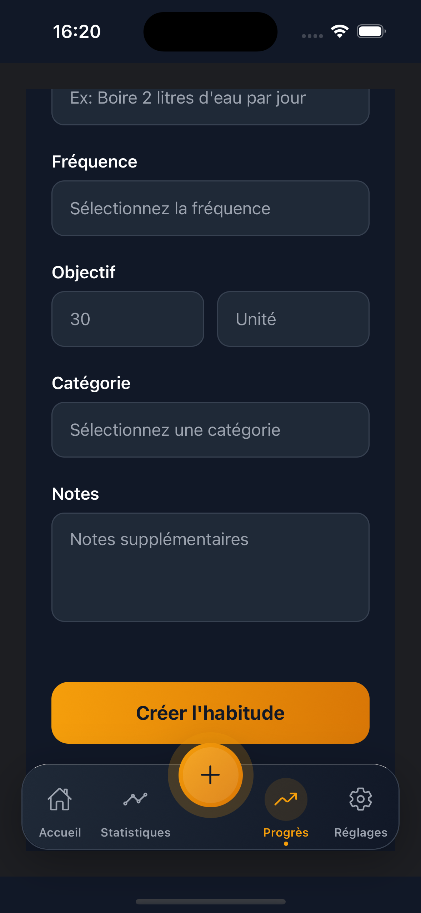

# HabitTracker

Application **React Native + Expo** avec navigation par tabs, gestion du SafeArea et écran de chargement personnalisé.

---

## Installation

```bash
git clone <url_du_repo>
cd habit-tracker
npm install
expo start
```

## Screenshots










